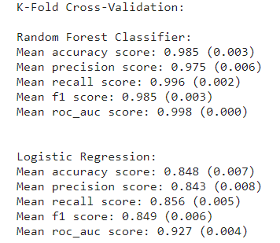

# Online Payment Fraud  Detection

## Introduction

This repository contains the "Online Payment Fraud Detection" project implemented using Python, machine learning, and exploratory data analysis.
### Overview

In the fast growth of online shopping and transactions, the need for strong security to stop fake activities is very important. The "Online Payment Fraud Detection" project addresses this critical concern by leveraging advanced data science techniques to identify and prevent fraudulent transactions in real-time.
## Objective

The primary objective of this project is to train machine learning models for identifying fraudulent and non-fraudulent payments.

### Dataset

The dataset consists of 10 variables:

1. `step`: represents a unit of time where 1 step equals 1 hour
2. `type`: type of online transaction
3. `amount`: the amount of the transaction
4. `nameOrig`: customer starting the transaction
5. `oldbalanceOrg`: balance before the transaction
6. `newbalanceOrig`: balance after the transaction
7. `nameDest`: recipient of the transaction
8. `oldbalanceDest`: initial balance of recipient before the transaction
9. `newbalanceDest`: the new balance of the recipient after the transaction
10. `isFraud`: indicates whether the transaction is fraudulent

### Python Libraries Used

- pandas
- numpy
- seaborn
- matplotlib
- tabulate
- scikit-learn (sklearn)

### Machine Learning Models

Random Forest and Logistics Regression were used to identify online payment fraud due to the large dataset.

### Read the complete Online Payment Fraud Detection project [here](online_payment_fraud_detection.ipynb)

### Kaggle Dataset

The dataset used in this project is available on Kaggle. You can access it [here](https://www.kaggle.com/datasets/rupakroy/online-payments-fraud-detection-dataset).

## Conclusion

The best-performing model for identifying fraudulent and non-fraudulent payments is Random Forest.

